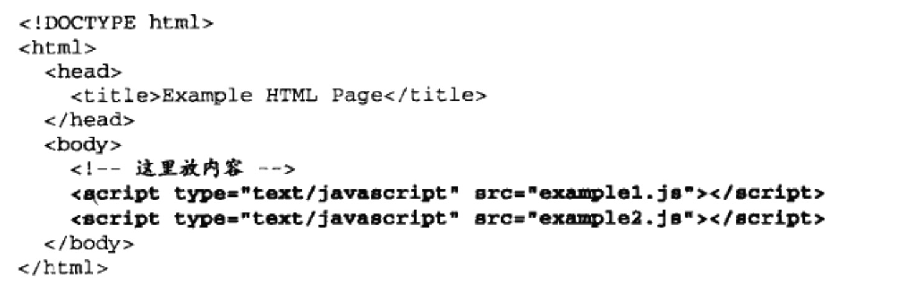
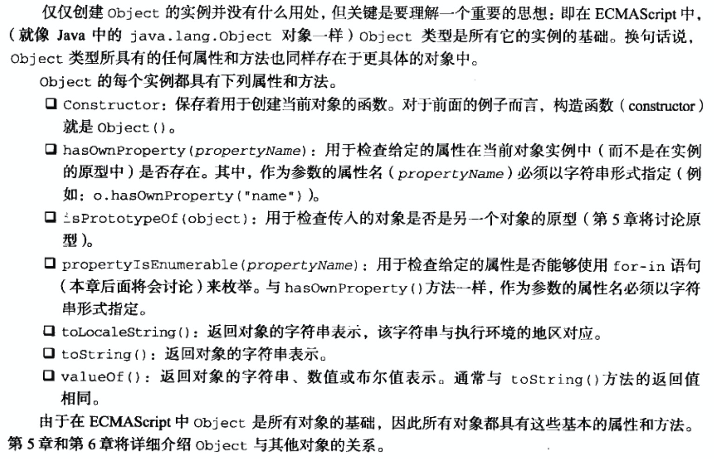

## 在HTML中使用JavaScript

### 使用`<script>`标签使页面接入script脚本

方式一：`<script type="text/javascript">console.log('内部实现js');</script>`

方式二：`<script type="text/javascript" src="xxx_file.js"></script>` 或者远程js文件`<script type="text/javascript" src="https://www.somewhere.com/afile.js"></script>`

### 标签属性

- async，立即下载脚本，但不妨碍页码的其他操作；设置方式``<script type="text/javascript" async="async" src="xxx_file.js"></script>``
- charset，通过src属性指定的字符集
- defer，脚本可以延迟到文档完全被解析和显示之后再执行；设置方式`<script type="text/javascript" defer="defer" src="xxx_file.js"></script>`
- src，外部文件
- type，非必需，没有指定这个属性，则默认值为**text/javascript**
- language：已废弃

### 标签位置

​	放置在`<body></body>`的后面内容，保证页面内容正常加载




## 基本概念

### 语法

- 区分大小写

- 标识符（变量、函数、属性的名字、函数的参数）推荐使用驼峰命名法

  - 第一个字符必须为字母、下划线(_)、美元符号($)
  - 其他字符可以包括数字

- 注释方式

  ```javascript
  // 单行注释
  
  /*
   * 多行注释
   */
  ```

- ###### 严格模式

  提供编译指示，告诉JavaScript编译引擎处理

  ```javascript
  //js文件首行增加
  "use strict";
  ```

- 语句结尾使用分号作为结束：**;**

- 使用 **{}** 包括代码块

### 数据类型

- Undefined：未定义

- Null：空

- Boolean：布尔值

- Number

  - 八进制在严格模式下无效，*SyntaxError*
  - *isFinite() 判断值是否位于负无穷到正无穷之间*
  - NaN 非数值。
    - 任何涉及NaN的操作都会返回NaN
    - NaN与任何数值都不相等，包括它自己
    - isNaN() 输入一个参数，将其转换为数值，并判断是否“不是数值”
  - 转型函数
    - Number()：将任何数据类型转换为数值
    - parseInt()、parseFloat()：将字符串类型转换为数值
      - parseInt() 字符串转换，如果第一个字符不是数字字符或者负号，则返回NaN
      - parseInt() 字符串转换，直到解析到非数字字符，忽略后面内容
      - parseInt()做进制转换时，最佳实践指定进制基数
      - parseFloat()遇到第二个小数点后忽略后面内容

- String

  - 字符串为不可变类型
  - 字符串属性：length 
  - toString()：转换为字符串的**方法**。数值、布尔值、对象、字符串支持。null与undefined不支持。
  - String()：转型函数

- Object：对象，一组数据与功能的集合

  - 属性与方法（第五章）

    

**typeof**操作符：检测给定变量的数据类型。（因为是操作符，所以可以不用函数调用）

```javascript
"use strict";
console.log("\nString:");
console.log("==========字符串方法===================")
console.log("javascript".length); // 10
console.log(String(123)); //123
console.log(String(true)); //true
console.log(String(undefined)); //undefined
console.log(String(null)); //null
console.log(String(false)); //false

console.log("\nNumber:");
console.log("==========转型函数===================")
let obj = {a:1};
console.log(typeof(obj), obj.valueOf(), typeof(obj.valueOf()));

console.log(Number({})); //NaN
console.log(Number("123")); //123
console.log(Number("12.3")); //12.3
console.log(Number("number")); //NaN
console.log(Number("")); //0
console.log(Number(true)); //1
console.log(Number(false), Number(undefined), Number(null)); //0 NaN 0

console.log(parseInt("-123")); // -123
console.log(parseInt("123adf")); // 123
console.log(parseInt("")); // NaN
console.log(parseInt("adf")); // NaN
console.log(parseInt("123.123")); // 123


console.log("==========NaN类型===================")
console.log(NaN); //NaN
console.log(typeof NaN); //number
console.log(100 / 0); // NaN
console.log(NaN == NaN); //false
console.log(isNaN(123)); //false
console.log(isNaN("123")); //false
console.log("123", typeof("123")); //123 string
console.log("123" == 123) // true
console.log(isNaN("number")); // true
// console.log(012); // SyntaxError: Octal literals are not allowed in strict mode.
console.log(12); //12
console.log(0x12); //18
console.log(3e-17); //3e-17
console.log(0.1 + 0.2); //0.30000000000000004 浮点数值的最高精度为17位
console.log(Number.MIN_VALUE); //最小值 5e-324
console.log(Number.MAX_VALUE); //最大值 1.7976931348623157e+308
console.log(Number.MAX_SAFE_INTEGER); // 9007199254740991
console.log(Number.MIN_SAFE_INTEGER); // -9007199254740991
console.log(Number.MAX_VALUE * 2); // Infinity
console.log(Infinity); // Infinity 超出MAX_VALUE，得到正无穷
let num = Number.MAX_VALUE * 2;
console.log(isFinite(num)); // false isFinite() 判断值是否位于负无穷到正无穷之间
console.log(Infinity + 100);
// for (let i = Infinity; i <= Infinity + 2; i++){
//     console.log(i, "Infinity可以操作"); //无法继续计算
// }

console.log("\nundefined与null:");
let message = null;
// let message;
console.log(typeof message); // object null是一个空指针对象

if (message != undefined) {
  console.log("message 不为null");
} else {
  console.log("message 为null");
}

console.log(undefined == null); // true undefined值派生自null的值。
console.log(undefined === null); // false

console.log("\nboolean类型:");
console.log(typeof true); // boolean
console.log(Boolean(undefined)); // false
console.log(Boolean(NaN)); // false
console.log(1 == true); // true
console.log(0 == false); //true
```

最佳实践：变量声明可以先初始化为null。

### 操作符

- 一元操作符

- 位操作符

- 布尔操作符

- 乘性操作符

- 加性操作符

- 关系操作符

- 相等操作符

  `===`全等操作，不转换操作数类型

- 条件操作符

  `variable = boolean_expression ? true_value : false_value`

- 赋值操作符

- 逗号操作符

### 语句

- if 语句
- do-while 语句
- whie语句
- for 语句
- for-in 语句
- label 语句
- break和continue 语句
- with 语句
- switch 语句

### 函数

- 所有参数的传递都是值，不可能通过引用传递参数
- 没有重载函数

## 变量、作用域和内存问题

### 基本类型与引用类型

- 基本类型
  - Undefined Null Boolean Number String
  - 按值访问，操作保存在变量中的实际的值
  - 复制--》值
- 引用类型
  - 引用类型可以增加属性与方法
  - 复制--》引用（指针地址--指向堆内存的一个对象）